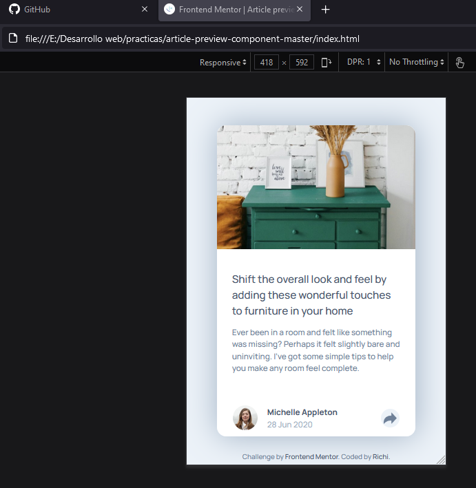
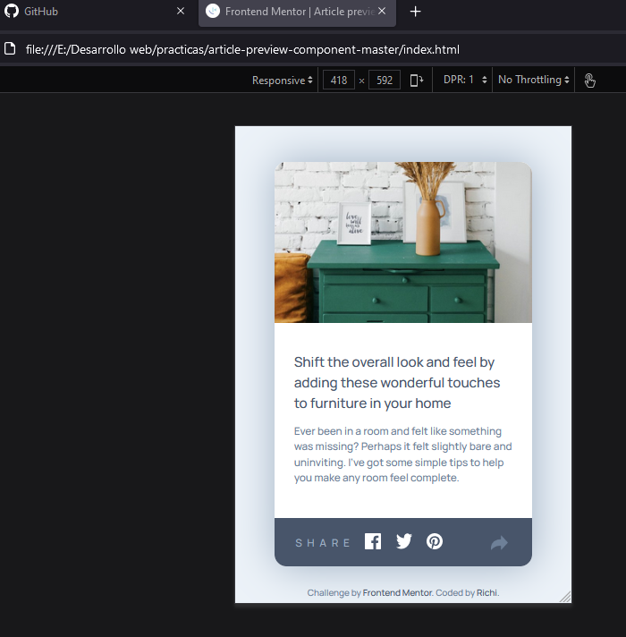
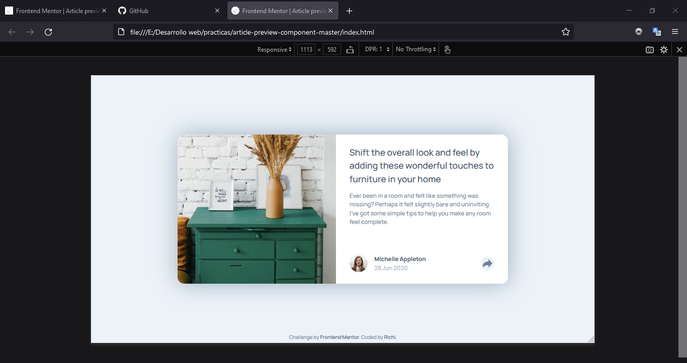
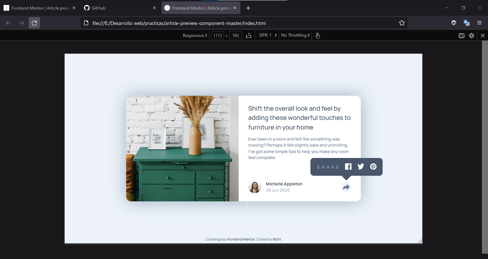

# Frontend Mentor - Article preview component solution

This is a solution to the [Article preview component challenge on Frontend Mentor](https://www.frontendmentor.io/challenges/article-preview-component-dYBN_pYFT). Frontend Mentor challenges help you improve your coding skills by building realistic projects.

## Table of contents

-   [Overview](#overview)
    -   [The challenge](#the-challenge)
    -   [Screenshot](#screenshot)
    -   [Links](#links)
-   [My process](#my-process)
    -   [Built with](#built-with)
    -   [What I learned](#what-i-learned)
    -   [Continued development](#continued-development)
    -   [Useful resources](#useful-resources)
-   [Author](#author)
-   [Acknowledgments](#acknowledgments)

## Overview

This challenge was made using just HTML, CSS (SASS and Flexbox) and for third time JavaScrip.

### The challenge

Users should be able to:

-   View the optimal layout for the app depending on their device's screen size
-   See hover states for all interactive elements on the page
-   Show and hide share pannel in mobile version
-   Show and hide share popover in desktop version

### Screenshot









### Links

-   Solution URL: [Github repository](https://github.com/AndresRicardo/article-preview-component-master)
-   Live Site URL: [Github page](https://andresricardo.github.io/article-preview-component-master/)

## My process

I'm just starting to learn web development, for now I only know some html, css (flexbox and grid included), sass and Javascript, basics of css framework bootstrap, no css post-processors, no Js frameworks, but i'm on the way.

### Built with

-   Semantic HTML5 markup
-   CSS custom properties
-   Css Flexbox
-   Css pre-processor sass
-   JavaScrip
-   Mobile-first workflow

### What I learned

doing this challenge i learned basics of DOM manage with JavaScritp

```javascript
const contact = document.getElementById("contact");
const popover = document.getElementById("popover");
const shareIcon = document.getElementById("shareIcon");
const sharePannel = document.getElementById("sharePannel");
const shareIcon2 = document.getElementById("shareIcon2");
```

i learned some of eventListeners and event delegation

```javascript
shareIcon.addEventListener("click", (event) => {
    event.stopPropagation();
    tooglePannel();
});

shareIcon2.addEventListener("click", (event) => {
    event.stopPropagation();

    tooglePannel();
});

document.addEventListener("click", (event) => {
    event.stopPropagation();

    const pageWidth = document.documentElement.scrollWidth;
    if (
        // contact.style.display === "none" &&
        event.target.id !== "sharePannel" &&
        event.target.id !== "shareIcon" &&
        event.target.id !== "shareIconImg" &&
        event.target.id !== "shareIcon2" &&
        event.target.id !== "shareIcon2Img" &&
        event.target.id !== "shareText"
    )
        showContact();
});
```

### Continued development

Even if to me is more complex design mobile first, i will continue develop of this way.
By now in short time, my next skills to develop are css post-processors (postcss), deeping in javascript, typescript and start with angular.

### Useful resources

-   [Developer mozilla](https://developer.mozilla.org/es/docs/Web/CSS/) - This helped me like general reference.

## Author

-   Website - [Richi](https://github.com/AndresRicardo)
-   Frontend Mentor - [@AndresRicardo](https://www.frontendmentor.io/profile/AndresRicardo)

## Acknowledgments

To my mom and dad jajajajja.
